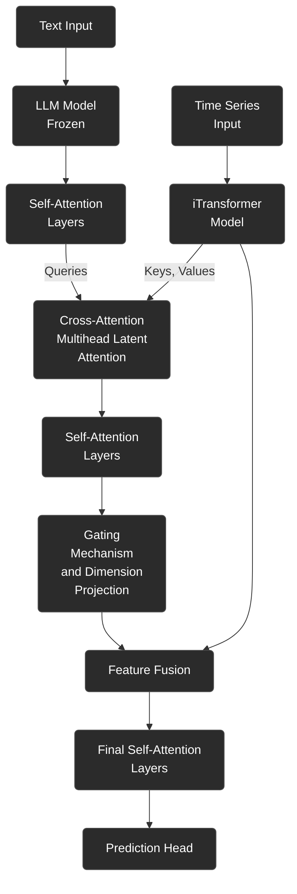

# Chimera: Token-Level Multimodal Fusion Model Implementation Plan

This document outlines the implementation plan for the Chimera model, a new multimodal architecture that performs token-level fusion between time series and text data using cross-attention mechanisms.

## 1. Architecture Overview



*Note: Configurable layer arguments (`--text_fusion_layers`, `--post_fusion_layers`, `--final_layers`) apply to the respective Self-Attention blocks.*

## 2. New Module Structure

### 2.1 New Files to Create

1. `models/ChimeraTransformer.py`: Main model implementation
2. `layers/CrossAttention.py`: Cross-attention and multihead latent attention mechanisms
3. `layers/GatingMechanism.py`: Gating mechanism for controlling fusion

## 3. Detailed Implementation Plan

This is Claude's tentative implementation plan.

### 3.1 `models/ChimeraTransformer.py`

```python
import torch
import torch.nn as nn
import torch.nn.functional as F
from layers.Transformer_EncDec import Encoder, EncoderLayer
from layers.SelfAttention_Family import FullAttention, AttentionLayer
from layers.Embed import DataEmbedding_inverted
from layers.CrossAttention import MultiheadLatentAttention
from layers.GatingMechanism import FeatureGate
import numpy as np

class Model(nn.Module):
    def __init__(self, configs):
        super(Model, self).__init__()
        self.task_name = configs.task_name
        self.seq_len = configs.seq_len
        self.pred_len = configs.pred_len
        self.output_attention = configs.output_attention
        self.configs = configs  # Store configs for helper methods
        self.gate_regularization = configs.gate_regularization_lambda > 0

        # Build model components modularly
        self._build_itransformer_components()
        self._build_text_fusion_components()
        self._build_cross_attention()
        self._build_post_fusion_layers()
        self._build_gating_mechanism()
        self._build_final_layers()
        self._build_projection_head()

    def _build_itransformer_components(self):
        """Initializes the core iTransformer components (embedding and encoder)."""
        configs = self.configs
        self.enc_embedding = DataEmbedding_inverted(configs.seq_len, configs.d_model, configs.embed, configs.freq,
                                                   configs.dropout)
        self.encoder = Encoder(
            [
                EncoderLayer(
                    AttentionLayer(
                        FullAttention(False, configs.factor, attention_dropout=configs.dropout,
                                     output_attention=self.output_attention), configs.d_model, configs.n_heads),
                    configs.d_model,
                    configs.d_ff,
                    dropout=configs.dropout,
                    activation=configs.activation
                ) for _ in range(configs.e_layers)
            ],
            norm_layer=torch.nn.LayerNorm(configs.d_model)
        )

    def _build_text_fusion_components(self):
        """Initializes the text processing components (optional self-attention)."""
        configs = self.configs
        self.text_fusion_layers = configs.text_fusion_layers
        self.text_encoder = None
        if self.text_fusion_layers > 0:
            self.text_encoder = Encoder(
                [
                    EncoderLayer(
                        AttentionLayer(
                            FullAttention(False, configs.factor, attention_dropout=configs.dropout,
                                         output_attention=self.output_attention), configs.d_llm, configs.n_heads),
                        configs.d_llm,
                        configs.d_ff,
                        dropout=configs.dropout,
                        activation=configs.activation
                    ) for _ in range(self.text_fusion_layers)
                ],
                norm_layer=torch.nn.LayerNorm(configs.d_llm)
            )

    def _build_cross_attention(self):
        """Initializes the cross-modal attention mechanism."""
        configs = self.configs
        self.latent_dim = configs.latent_dim if hasattr(configs, 'latent_dim') else min(configs.d_model, configs.d_llm)
        self.cross_attention = MultiheadLatentAttention(
            query_dim=configs.d_llm,       # Text features dimension
            key_dim=configs.d_model,       # Time series features dimension
            latent_dim=self.latent_dim,
            num_heads=configs.fusion_heads if hasattr(configs, 'fusion_heads') else configs.n_heads,
            dropout=configs.dropout
        )

    def _build_post_fusion_layers(self):
        """Initializes the optional self-attention layers after cross-attention."""
        configs = self.configs
        self.post_fusion_layers = configs.post_fusion_layers
        self.post_fusion_encoder = None
        if self.post_fusion_layers > 0:
            self.post_fusion_encoder = Encoder(
                [
                    EncoderLayer(
                        AttentionLayer(
                            FullAttention(False, configs.factor, attention_dropout=configs.dropout,
                                         output_attention=self.output_attention), self.latent_dim, configs.n_heads),
                        self.latent_dim,
                        configs.d_ff,
                        dropout=configs.dropout,
                        activation=configs.activation
                    ) for _ in range(self.post_fusion_layers)
                ],
                norm_layer=torch.nn.LayerNorm(self.latent_dim)
            )

    def _build_gating_mechanism(self):
        """Initializes the gating mechanism based on the specified type."""
        configs = self.configs
        self.feature_gate = FeatureGate(
            fused_dim=self.latent_dim,     # Dimension of latent space from cross-attention/post-fusion
            ts_dim=configs.d_model,        # Dimension of original time series features
            gate_type=configs.gate_type,
            hidden_dim=configs.gate_hidden_dim if hasattr(configs, 'gate_hidden_dim') else 2*configs.d_model # Only used for mlp gate
        )

    def _build_final_layers(self):
        """Initializes the optional final self-attention layers after gating."""
        configs = self.configs
        self.final_layers = configs.final_layers
        self.final_encoder = None
        if self.final_layers > 0:
            self.final_encoder = Encoder(
                [
                    EncoderLayer(
                        AttentionLayer(
                            FullAttention(False, configs.factor, attention_dropout=configs.dropout,
                                         output_attention=self.output_attention), configs.d_model, configs.n_heads),
                        configs.d_model,
                        configs.d_ff,
                        dropout=configs.dropout,
                        activation=configs.activation
                    ) for _ in range(self.final_layers)
                ],
                norm_layer=torch.nn.LayerNorm(configs.d_model)
            )

    def _build_projection_head(self):
        """Initializes the task-specific projection head."""
        configs = self.configs
        if self.task_name == 'long_term_forecast' or self.task_name == 'short_term_forecast':
            self.projection = nn.Linear(configs.d_model, configs.pred_len, bias=True)
        elif self.task_name == 'imputation':
            self.projection = nn.Linear(configs.d_model, configs.seq_len, bias=True)
        elif self.task_name == 'anomaly_detection':
            self.projection = nn.Linear(configs.d_model, configs.seq_len, bias=True)
        elif self.task_name == 'classification':
            self.act = F.gelu
            self.dropout = nn.Dropout(configs.dropout)
            self.projection = nn.Linear(configs.d_model * configs.enc_in, configs.num_class)
        else:
            # Default or raise error for unsupported task
            self.projection = nn.Linear(configs.d_model, configs.pred_len, bias=True)

    def forward_text_encoder(self, text_embeddings):
        """Process text embeddings through optional self-attention layers."""
        if self.text_encoder is not None:
            text_features, _ = self.text_encoder(text_embeddings, attn_mask=None)
        else:
            text_features = text_embeddings
        return text_features
    
    def forward_fusion_and_post_process(self, text_features, ts_features):
        """Perform cross-modal fusion and optional post-fusion self-attention.
        
        Args:
            text_features: Features from text encoder (B, L, d_llm)
            ts_features: Features from iTransformer (B, L, d_model)
            
        Returns:
            fused_latent_features: Fused features in latent space (B, L, latent_dim)
        """
        # Cross-attention fusion
        fused_latent_features = self.cross_attention(
            queries=text_features,  # Text as query
            keys=ts_features,       # Time series as key
            values=ts_features      # Time series as value
        )
        
        # Post-fusion self-attention if specified
        if self.post_fusion_encoder is not None:
            fused_latent_features, _ = self.post_fusion_encoder(fused_latent_features, attn_mask=None)
            
        return fused_latent_features
    
    def forward_gating_fusion(self, fused_latent_features, ts_features):
        """Apply gating mechanism to control fusion strength.
        
        Args:
            fused_latent_features: Features from cross-attention/post-fusion (B, L, latent_dim)
            ts_features: Original time series features from iTransformer (B, L, d_model)
            
        Returns:
            gated_output: Combined features in time series dimension (B, L, d_model)
            gate_value: The computed gate (G or alpha) for potential regularization (B, L, d_model)
        """
        gated_output, gate_value = self.feature_gate(
            fused_latent_features, ts_features
        )
        return gated_output, gate_value
    
    def forecast(self, x_enc, x_mark_enc, x_dec, x_mark_dec, text_embeddings=None):
        gate_value = None # Initialize gate value
        
        # Normalization from Non-stationary Transformer
        means = x_enc.mean(1, keepdim=True).detach()
        x_enc = x_enc - means
        stdev = torch.sqrt(torch.var(x_enc, dim=1, keepdim=True, unbiased=False) + 1e-5)
        x_enc /= stdev

        _, _, N = x_enc.shape

        # Time series embedding and encoding
        enc_out = self.enc_embedding(x_enc, x_mark_enc)
        ts_features, _ = self.encoder(enc_out, attn_mask=None)
        
        # Process text if available for multimodal fusion
        if text_embeddings is not None:
            # Text processing
            text_features = self.forward_text_encoder(text_embeddings)
            
            # Cross-modal fusion and optional post-processing
            fused_latent_features = self.forward_fusion_and_post_process(text_features, ts_features)
            
            # Gated fusion with time series features (includes dimension projection)
            final_features, gate_value = self.forward_gating_fusion(fused_latent_features, ts_features)
            
            # Final transformer layers if specified
            if self.final_encoder is not None:
                final_features, _ = self.final_encoder(final_features, attn_mask=None)
        else:
            final_features = ts_features
        
        # Task-specific prediction
        dec_out = self.projection(final_features).permute(0, 2, 1)[:, :, :N]
        
        # De-Normalization from Non-stationary Transformer
        dec_out = dec_out * (stdev[:, 0, :].unsqueeze(1).repeat(1, self.pred_len, 1))
        dec_out = dec_out + (means[:, 0, :].unsqueeze(1).repeat(1, self.pred_len, 1))
        
        if self.gate_regularization and self.training:
            return dec_out, gate_value
        else:
            return dec_out

    # Implement other task methods (imputation, anomaly_detection, classification) similarly
    # by adapting the existing iTransformer implementations with the fusion components

    def forward(self, x_enc, x_mark_enc, x_dec, x_mark_dec, text_embeddings=None, mask=None):
        # Handle different tasks
        if self.task_name == 'long_term_forecast' or self.task_name == 'short_term_forecast':
            if self.gate_regularization and self.training:
                dec_out, gate_value = self.forecast(x_enc, x_mark_enc, x_dec, x_mark_dec, text_embeddings)
                return dec_out, gate_value # Return gate for regularization loss
            else:
                dec_out = self.forecast(x_enc, x_mark_enc, x_dec, x_mark_dec, text_embeddings)
                return dec_out  # [B, L, D]
        
        elif self.task_name == 'imputation':
            # Adapt imputation method similarly, potentially returning gate value
            pass 
        elif self.task_name == 'anomaly_detection':
            # Adapt anomaly detection method similarly
            pass
        elif self.task_name == 'classification':
            # Adapt classification method similarly
            pass
        
        # Fallback or error for unsupported task
        return None 
```

### 3.2 `layers/CrossAttention.py`

```python
import torch
import torch.nn as nn
import math

class MultiheadLatentAttention(nn.Module):
    """
    Multihead Latent Cross-Attention mechanism for token-level fusion.
    
    This module projects query and key/value inputs into a shared latent space
    where cross-attention is performed, enabling effective fusion of modalities
    with different dimensions.
    
    In the Chimera model:
    - Queries come from the text features
    - Keys and values come from the iTransformer output
    """
    def __init__(self, query_dim, key_dim, latent_dim, num_heads=8, dropout=0.1):
        super(MultiheadLatentAttention, self).__init__()
        self.num_heads = num_heads
        self.latent_dim = latent_dim
        self.head_dim = latent_dim // num_heads
        assert self.head_dim * num_heads == latent_dim, "latent_dim must be divisible by num_heads"
        
        # Projection layers to latent space
        self.q_proj = nn.Linear(query_dim, latent_dim)
        self.k_proj = nn.Linear(key_dim, latent_dim)
        self.v_proj = nn.Linear(key_dim, latent_dim)
        
        self.dropout = nn.Dropout(dropout)
        self.out_proj = nn.Linear(latent_dim, latent_dim)
        
        self.scale = self.head_dim ** -0.5
        
    def forward(self, queries, keys, values, attention_mask=None):
        """
        Perform cross-attention in latent space
        
        Args:
            queries: Tensor from text branch (B, L_q, query_dim)
            keys: Tensor from time series branch (B, L_k, key_dim)
            values: Tensor from time series branch (B, L_v, key_dim)
            attention_mask: Optional mask for attention
            
        Returns:
            Fused features in latent space (B, L_q, latent_dim)
        """
        batch_size = queries.shape[0]
        
        # Project to latent space
        q = self.q_proj(queries)  # (batch_size, seq_len_q, latent_dim)
        k = self.k_proj(keys)     # (batch_size, seq_len_k, latent_dim)
        v = self.v_proj(values)   # (batch_size, seq_len_v, latent_dim)
        
        # Reshape for multihead attention
        q = q.view(batch_size, -1, self.num_heads, self.head_dim).transpose(1, 2)  # (batch, heads, seq_q, head_dim)
        k = k.view(batch_size, -1, self.num_heads, self.head_dim).transpose(1, 2)  # (batch, heads, seq_k, head_dim)
        v = v.view(batch_size, -1, self.num_heads, self.head_dim).transpose(1, 2)  # (batch, heads, seq_v, head_dim)
        
        # Attention scores
        attn_scores = torch.matmul(q, k.transpose(-2, -1)) * self.scale  # (batch, heads, seq_q, seq_k)
        
        # Apply mask if provided
        if attention_mask is not None:
            attn_scores = attn_scores.masked_fill(attention_mask == 0, -1e9)
        
        # Softmax and dropout
        attn_weights = torch.softmax(attn_scores, dim=-1)
        attn_weights = self.dropout(attn_weights)
        
        # Apply attention to values
        output = torch.matmul(attn_weights, v)  # (batch, heads, seq_q, head_dim)
        
        # Reshape back
        output = output.transpose(1, 2).contiguous().view(batch_size, -1, self.latent_dim)
        
        # Final projection
        output = self.out_proj(output)
        
        return output
```

### 3.3 `layers/GatingMechanism.py`

```python
import torch
import torch.nn as nn
import torch.nn.functional as F

class FeatureGate(nn.Module):
    """
    Gating mechanism to control the fusion of multimodal features with multiple options.
    
    Handles projecting fused features from latent dimension to time series dimension
    and computes a gate value to combine with original time series features.
    
    Options for gate computation (`gate_type`):
    - 'mlp': Original two-layer MLP gate network.
    - 'simple_linear': Simple adaptive gate (alpha) using one linear layer on concatenated features.
    - 'lightweight_linear': Lightweight linear gate using LayerNorm.
    - 'vector_gate_linear': Lightweight linear gate (G) using LayerNorm, applied like MLP gate.
    - 'per_token_scalar': Linear gate producing one scalar per token.
    - 'global_scalar': Mean-pooled inputs to a linear gate producing one scalar per batch.
    """
    def __init__(self, fused_dim, ts_dim, gate_type='mlp', hidden_dim=None):
        super(FeatureGate, self).__init__()
        self.gate_type = gate_type
        self.fused_dim = fused_dim # latent_dim from previous step
        self.ts_dim = ts_dim # d_model

        # --- Projection Layer (Common to all gate types) ---
        # Projects fused features (latent_dim) to time series dimension (ts_dim)
        # Uses hidden_dim only if gate_type is 'mlp' (for compatibility)
        proj_hidden_dim = hidden_dim if hidden_dim is not None else 2 * ts_dim
        self.fused_projection = nn.Sequential(
            nn.Linear(fused_dim, proj_hidden_dim), # Use proj_hidden_dim for potential MLP compatibility
            nn.ReLU(),
            nn.Linear(proj_hidden_dim, ts_dim)
        )

        # --- Gate Computation Network (Varies by gate_type) ---
        if gate_type == 'mlp':
            if hidden_dim is None:
                hidden_dim = 2 * ts_dim
            self.gate_network = nn.Sequential(
                nn.Linear(fused_dim + ts_dim, hidden_dim),
                nn.ReLU(),
                nn.Linear(hidden_dim, ts_dim),
                nn.Sigmoid()
            )
        elif gate_type == 'simple_linear':
            # Computes alpha = sigma(Linear([F, T]))
            self.gate_network = nn.Sequential(
                nn.Linear(fused_dim + ts_dim, ts_dim),
                nn.Sigmoid()
            )
        elif gate_type == 'lightweight_linear' or gate_type == 'vector_gate_linear': # Use same computation
            # Computes gate = sigma(LayerNorm(Linear([F, T])))
            self.gate_network = nn.Sequential(
                nn.Linear(fused_dim + ts_dim, ts_dim),
                nn.LayerNorm(ts_dim), # Apply LayerNorm before sigmoid
                nn.Sigmoid()
            )
        elif gate_type == 'per_token_scalar' or gate_type == 'global_scalar': # Use same computation
            # Computes beta = sigma(Linear([F+T, 1]))
            self.gate_network = nn.Sequential(
                nn.Linear(fused_dim + ts_dim, 1),
                nn.Sigmoid()
            )
        else:
            raise ValueError(f"Unsupported gate_type: {gate_type}. Choose 'mlp', 'simple_linear', 'lightweight_linear', 'vector_gate_linear', 'per_token_scalar', 'global_scalar'.")

    def forward(self, fused_latent_features, ts_features):
        """
        Apply gating mechanism to control information flow.
        
        Args:
            fused_latent_features: Features from cross-attention/post-fusion (B, L, fused_dim)
            ts_features: Original time series features from iTransformer (B, L, ts_dim)
            
        Returns:
            gated_output: Combined features with learned gating (B, L, ts_dim)
            gate_value: The computed gate (G, alpha, or beta) for potential regularization (B, L, ts_dim)
        """
        # Project fused features from latent dimension to time series dimension
        projected_fused = self.fused_projection(fused_latent_features) # F' (B, L, ts_dim)
        
        # Compute gate value (G, alpha, or beta)
        # Input features for gate computation need the pre-projection fused features (F)
        concat_features = torch.cat([fused_latent_features, ts_features], dim=-1) # [F, T]

        if self.gate_type == 'global_scalar':
            pooled = concat_features.mean(dim=1)
            beta = self.gate_network(pooled)
            gate_value = beta.unsqueeze(1).unsqueeze(2)
        else:
            gate_value = self.gate_network(concat_features) # G, alpha, or beta
        
        # Apply one of gate G, alpha, or beta: 
        # O = G * F' + (1 - G) * T
        # O = alpha * T + (1 - alpha) * F'
        # O = beta * T + (1 - beta) * F'
        if self.gate_type in {'mlp', 'vector_gate_linear'}:
            # Gate weights the projected fused features (F')
            gated_output = gate_value * projected_fused + (1 - gate_value) * ts_features
        elif self.gate_type in {'simple_linear', 'lightweight_linear', 
                                'per_token_scalar', 'global_scalar'}:
            # Gate weights the original time series features (T)
            gated_output = gate_value * ts_features + (1 - gate_value) * projected_fused
        # else case handled by __init__ check
        
        return gated_output, gate_value
```

### 3.4 Mathematical Description of Gating Options

This section provides the mathematical details for the different gating mechanisms available via the `--gate_type` argument. Let's define the inputs:

- **Fused Latent Features**: $ F \in \mathbb{R}^{B \times L \times d_f} $, the output of the cross-attention mechanism (potentially after post-fusion self-attention), where $ d_f $ is `latent_dim`.
- **Time Series Features**: $ T \in \mathbb{R}^{B \times L \times d_t} $, the output of the iTransformer encoder, where $ d_t $ is `d_model`.
- **Hidden Dimension**: $ d_h $, typically `gate_hidden_dim` (defaulting to $ 2 \times d_t $), used only for the `mlp` gate.
- **Batch size**: $ B $
- **Sequence Length**: $ L $

All gating mechanisms first require projecting the fused latent features $ F $ to the time series dimension $ d_t $ to enable combination.

1.  **Common Projection Step**:
    The fused features $ F $ are projected to $ F' \in \mathbb{R}^{B \times L \times d_t} $:
    $$
    F' = \text{FusedProjection}(F) = W_{p2} \cdot \text{ReLU}(W_{p1} F + b_{p1}) + b_{p2}
    $$
    where $ W_{p1} \in \mathbb{R}^{d_f \times d_h'} $, $ b_{p1} \in \mathbb{R}^{d_h'} $, $ W_{p2} \in \mathbb{R}^{d_h' \times d_t} $, $ b_{p2} \in \mathbb{R}^{d_t} $. Note that $ d_h' $ is the hidden dimension used in the projection network (defaults to $ 2 \times d_t $).

2.  **Gate Value Computation**:
    The gate value is computed based on the `gate_type` using the *pre-projection* fused features $ F $ and the time series features $ T $. Let $ C = [F, T] \in \mathbb{R}^{B \times L \times (d_f + d_t)} $ be the concatenation.

    *   **`mlp` Gate Type**:
        A two-layer MLP computes the gate $ G \in [0, 1]^{B \times L \times d_t} $:
        $$
        G = \sigma(W_{g2} \cdot \text{ReLU}(W_{g1} C + b_{g1}) + b_{g2})
        $$
        where $ W_{g1} \in \mathbb{R}^{(d_f + d_t) \times d_h} $, $ b_{g1} \in \mathbb{R}^{d_h} $, $ W_{g2} \in \mathbb{R}^{d_h \times d_t} $, $ b_{g2} \in \mathbb{R}^{d_t} $.

    *   **`simple_linear` Gate Type**:
        A single linear layer computes the gate $ \alpha \in [0, 1]^{B \times L \times d_t} $:
        $$
        \alpha = \sigma(W_g C + b_g)
        $$
        where $ W_g \in \mathbb{R}^{(d_f + d_t) \times d_t} $, $ b_g \in \mathbb{R}^{d_t} $.

    *   **`lightweight_linear` Gate Type**:
        A single linear layer followed by Layer Normalization computes the gate $ \alpha \in [0, 1]^{B \times L \times d_t} $:
        $$
        \alpha = \sigma(\text{LayerNorm}(W_g C + b_g))
        $$
        where $ W_g \in \mathbb{R}^{(d_f + d_t) \times d_t} $, $ b_g \in \mathbb{R}^{d_t} $.

    *   **`vector_gate_linear` Gate Type**:
        A single linear layer followed by Layer Normalization computes the gate $ G \in [0, 1]^{B \times L \times d_t} $ (same computation as `lightweight_linear`):
        $$
        G = \sigma(\text{LayerNorm}(W_g C + b_g))
        $$
        where $ W_g \in \mathbb{R}^{(d_f + d_t) \times d_t} $, $ b_g \in \mathbb{R}^{d_t} $.

    *   **`per_token_scalar` Gate Type**: 
        A simple linear layer that comuptes a gate with one scalar per time step/token. More interpretable, we know exactly when the model switches from weighing text vs. TS more highly. Computes gate $\beta \in [0, 1]^{B \times L \times 1}$
        $$
        \beta = \sigma (W_g C + b_g)
        $$
        where $W_b \in \mathbb{R}^{(d_f + d_t)\times 1}, b_g \in \mathbb{R}^{1}$.

    *   **`global_scalar` Gate Type**:
        Mean pooling along sequence length (to condense to a single scalar) followed by a linear layer. Simpler than per_token, but low granularity. Computes gate $\beta \in [0, 1]^{B \times 1 \times 1}$
        $$
        \beta = \sigma (W_g \bar C + b_g)
        $$
        where $W_b \in \mathbb{R}^{(d_f + d_t)\times 1}, b_g \in \mathbb{R}^{1}, \bar C = \text{Mean}_L [C] $.

3.  **Final Gated Output** ($ O \in \mathbb{R}^{B \times L \times d_t} $):
    The final output $ O $ is computed differently based on the gate type:

    *   For `gate_type='mlp'` or `gate_type='vector_gate_linear'`:
        The gate weights the projected fused features $ F' $:
        $$
        O = G \odot F' + (1 - G) \odot T
        $$
        where $ G $ is the gate value and $ \odot $ is element-wise multiplication.

    *   For `gate_type='simple_linear'` or `gate_type='lightweight_linear'`:
        The gate weights the original time series features $ T $:
        $$
        O = \alpha \odot T + (1 - \alpha) \odot F'
        $$
        where $ \alpha $ is the gate value.

    *   For `gate_type='per_token_scalar'` or `gate_type='global_scalar'`:
        The gate wegihts the original time series features $T$:
        $$
        O = \beta \odot T + (1 - \beta) \odot F'
        $$
        where $ \beta $ is the gate value.

4.  **Optional L1 Regularization Loss**:
    If `gate_regularization_lambda` ($ \lambda $) > 0, the following loss term is added during training:
    $$
    \mathcal{L}_{\text{reg}} = \lambda \cdot \text{mean}(|\text{gate\_value} - 0.5|)
    $$
    where `gate_value` is either $ G $ or $ \alpha $.

## 4. Changes to `exp/exp_long_term_forecasting.py`

The existing experiment class needs to be modified to support the Chimera model and optional gate regularization.

```python
import torch.nn.functional as F # Add this import

class Exp_Long_Term_Forecast(Exp_Basic):
    # ... Existing __init__ ...
    
    def _select_criterion(self):
        # Keep existing criterion selection
        criterion = nn.MSELoss()
        return criterion

    def _calculate_gate_regularization_loss(self, gate_value):
        """Calculates L1 regularization loss for the gate."""
        if gate_value is None or self.args.gate_regularization_lambda <= 0:
            return 0.0
        # L1 penalty pushing gate towards 0 or 1 (away from 0.5)
        reg_loss = torch.mean(torch.abs(gate_value - 0.5))
        return self.args.gate_regularization_lambda * reg_loss

    def train(self, setting):
        # ... Existing setup code ...
        
        for epoch in range(self.args.train_epochs):
            # ... existing epoch setup ...
            
            for i, (batch_x, batch_y, batch_x_mark, batch_y_mark, index) in enumerate(train_loader):
                model_optim.zero_grad()
                # ... existing data prep ...
                
                # Get text embeddings if available
                text_embeddings = None
                if self.args.model == 'ChimeraTransformer' and self.text_path != 'None':
                    # Code to get text embeddings from LLM (reuse existing logic)
                    # Placeholder: text_embeddings = self.get_text_embeddings(index)
                    pass # Replace with actual text embedding retrieval
                    
                # --- Forward pass --- 
                outputs = None
                gate_value = None 
                
                if self.args.model == 'ChimeraTransformer':
                    if self.args.gate_regularization_lambda > 0 and self.model.training:
                        outputs, gate_value = self.model(batch_x, batch_x_mark, 
                                                          batch_y[:, :self.args.label_len, :], 
                                                          batch_y_mark[:, :self.args.label_len, :], 
                                                          text_embeddings)
                    else:
                        outputs = self.model(batch_x, batch_x_mark, 
                                             batch_y[:, :self.args.label_len, :], 
                                             batch_y_mark[:, :self.args.label_len, :], 
                                             text_embeddings)
                else:
                    # Existing forward pass for other models
                    if self.args.output_attention:
                         outputs = self.model(batch_x, batch_x_mark, dec_inp, batch_y_mark)[0]
                    else:
                         outputs = self.model(batch_x, batch_x_mark, dec_inp, batch_y_mark)
                
                # --- Loss Calculation --- 
                f_dim = -1 if self.args.features == 'MS' else 0
                outputs = outputs[:, -self.args.pred_len:, f_dim:]
                batch_y = batch_y[:, -self.args.pred_len:, f_dim:].to(self.device)
                
                main_loss = criterion(outputs, batch_y)
                
                # Add gate regularization loss if applicable
                reg_loss = self._calculate_gate_regularization_loss(gate_value)
                total_loss = main_loss + reg_loss
                
                # --- Backward pass --- 
                if self.args.use_amp:
                    scaler.scale(total_loss).backward()
                    scaler.step(model_optim)
                    scaler.update()
                else:
                    total_loss.backward()
                    model_optim.step()
                    
                # ... rest of training loop (logging, etc.) ...
       
        # ... rest of train method ...
    
    def test(self, setting, test=0):
        # Similar modifications to forward pass in the test method
        # Ensure gate_value is not expected/used during testing
        # ... existing code ...
        # Inside the test loop:
        # ...
        # Get text embeddings if needed for ChimeraTransformer
        text_embeddings = None # Placeholder
        
        if self.args.model == 'ChimeraTransformer':
             outputs = self.model(batch_x, batch_x_mark, 
                                  batch_y[:, :self.args.label_len, :], 
                                  batch_y_mark[:, :self.args.label_len, :], 
                                  text_embeddings)
        else:
            # Existing forward pass for other models
             outputs = self.model(batch_x, batch_x_mark, dec_inp, batch_y_mark)
            
        # ... rest of testing loop ...
```

## 5. Run.py Modifications

Add new command-line arguments to `run.py`:

```python
# Chimera model parameters
parser.add_argument('--text_fusion_layers', type=int, default=2, 
                    help='number of self-attention layers to process text embeddings')
parser.add_argument('--post_fusion_layers', type=int, default=2, 
                    help='number of self-attention layers after cross-attention fusion')
parser.add_argument('--final_layers', type=int, default=1, 
                    help='number of final self-attention layers after gated fusion')
parser.add_argument('--fusion_heads', type=int, default=8, 
                    help='number of attention heads in cross-modal fusion')
parser.add_argument('--latent_dim', type=int, default=256, 
                    help='dimension of shared latent space for fusion')
parser.add_argument('--gate_type', type=str, default='mlp', 
                    help='Type of gating mechanism: mlp, simple_linear, lightweight_linear, vector_gate_linear')
parser.add_argument('--gate_hidden_dim', type=int, default=512, 
                    help='hidden dimension for MLP feature gating network (only used if gate_type is mlp)')
parser.add_argument('--gate_regularization_lambda', type=float, default=0.0, 
                    help='Lambda for L1 gate regularization (pushing gate value away from 0.5). Default 0.0 (disabled).')
```

## 6. Model Registry Update

_(No changes needed here, already done in previous steps)_ 

## 7. Example Usage

```bash
# Example using the 'simple_linear' gate with regularization
python run.py \
    --task_name long_term_forecast \
    --is_training 1 \
    --model ChimeraTransformer \
    --data ETTh1 \
    --root_path ./dataset/ETT/ \
    --data_path ETTh1.csv \
    --text_path text_data.csv \
    --freq h \
    --seq_len 96 \
    --pred_len 24 \
    --d_model 512 \
    --n_heads 8 \
    --e_layers 2 \
    --d_ff 2048 \
    --text_fusion_layers 2 \
    --post_fusion_layers 2 \
    --final_layers 1 \
    --latent_dim 256 \
    --fusion_heads 8 \
    --gate_type simple_linear \
    --gate_regularization_lambda 1e-4 \
    --batch_size 32 \
    --train_epochs 10 \
    --llm_model BERT \
    --pool_type attention
```

## 8. Implementation Notes

### 8.1 Damon Intuition

We use iTransformer because the mechanistic interpretability of the iTransformer in fusion is very nice. The time series tokens are time series features, and we get how those interact with concepts (via SAE or linear probing) from the text. It's beautiful I think. Also, iTransformer is performant in the unimodal case. 

In any case, this is a good starting point I think and we can adapt after we get this running.

### 8.2 Claude Intuition

The Chimera model significantly enhances the basic multimodal fusion approach by:

1. **Token-level fusion**: Instead of just combining predictions, it fuses features at the token level through cross-attention, allowing the model to learn which time series tokens should attend to which text tokens.

2. **Adaptive gating**: The gating mechanism allows the model to dynamically decide how much to rely on the fused information versus the original time series information, providing both interpretability and performance benefits.

3. **Hierarchical processing**: By using multiple stages of self-attention before and after fusion, the model can better capture complex relationships both within and across modalities.

### 8.2 Design Considerations

1. **Computational Efficiency**: The cross-attention mechanism can be computationally expensive, especially when the sequence lengths are large. Consider using efficient attention variants for long sequences.

2. **Memory Usage**: The model introduces several new components that increase memory usage. For large models, gradient checkpointing may be necessary.

3. **Flexibility**: The architecture is designed to be flexible, with the number of layers at each stage configurable through command-line arguments. Setting these values to 0 effectively disables those components.

4. **Dimension Management**: The model manages several different dimensions:
   - Text embeddings dimension (d_llm)
   - Time series features dimension (d_model)
   - Shared latent space dimension (latent_dim)
   - The gating mechanism must project from latent_dim back to d_model for fusion with iTransformer output

5. **Gating Mechanism Options**: The `--gate_type` argument allows experimenting with different gating complexities:
    - `mlp`: The original, more complex two-layer MLP gate.
    - `simple_linear`: Efficient single linear layer gate, weights \( T \) (\( \alpha \)).
    - `lightweight_linear`: Adds LayerNorm to `simple_linear`, weights \( T \) (\( \alpha \)).
    - `vector_gate_linear`: Uses `lightweight_linear` computation, but weights \( F' \) (\( G \)) like `mlp`.

6. **Gate Regularization**: The optional L1 regularization (`--gate_regularization_lambda > 0`) encourages the gate values to be closer to 0 or 1, promoting more decisive fusion and improving interpretability. This loss is added only during training.

### 8.3 Training Strategy

1. Start with pre-training the iTransformer part of the model on time series data only (ideally we find a pre-trained set of weights for this -- a foundation model).
2. Then freeze the iTransformer weights and train only the fusion components. Train / val data will initially (for testing) be a k-fold CV on the Time-MMD dataset (small). However, since this is the benchmark, for final evaluation we would ideally train on something else (earnings calls and financial statements + hopefully scrape more of our own data that covers the same range of topics as the benchmark), then evaluate on the benchmark.
3. Finally, fine-tune the entire model end-to-end with a lower learning rate.

This staged approach can help stabilize training and prevent the fusion components from dominating before they've learned meaningful representations.

### 8.4 Potential Extensions

1. **Bidirectional Cross-Attention**: Currently, queries come from text and keys/values from time series. A bidirectional approach could allow information to flow both ways.

2. **Hierarchical Fusion**: For complex tasks, multiple levels of fusion at different layers of the model could be beneficial.

3. **Regularization Techniques**: Special regularization for the gating mechanism could encourage it to be more selective, improving interpretability.

## 9. Conclusion

The Chimera model represents a sophisticated approach to multimodal fusion, leveraging the strengths of both transformer-based time series models and text embeddings from LLMs. By fusing at the token level and offering flexible, potentially regularized gating mechanisms, it has the potential to outperform simpler fusion approaches, especially in scenarios where the relationship between text and time series data is complex and context-dependent. 