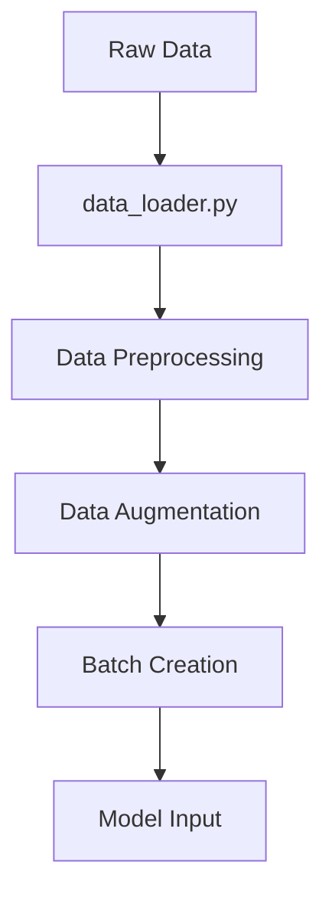
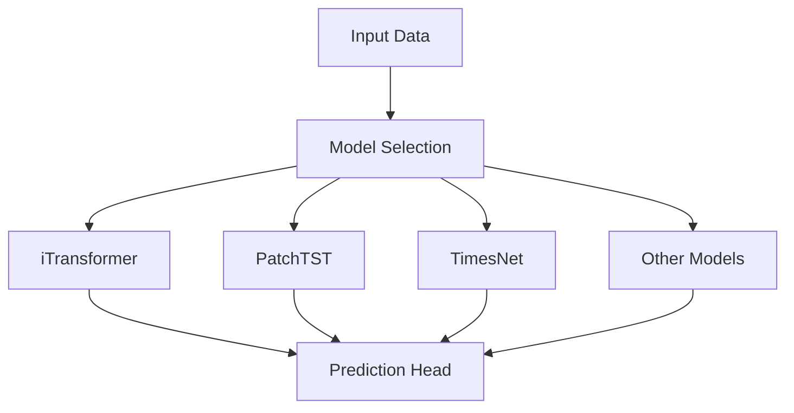
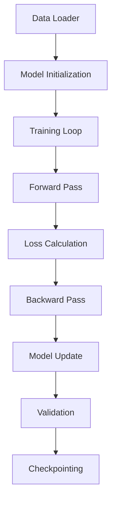
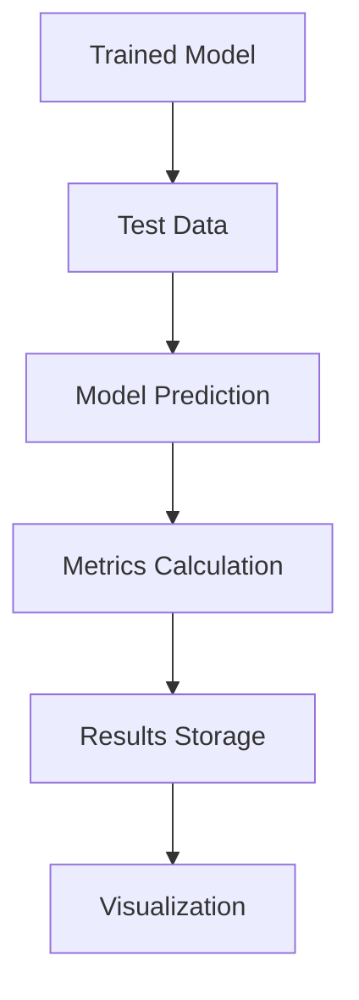
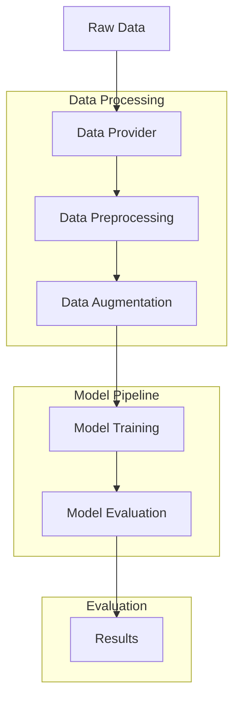
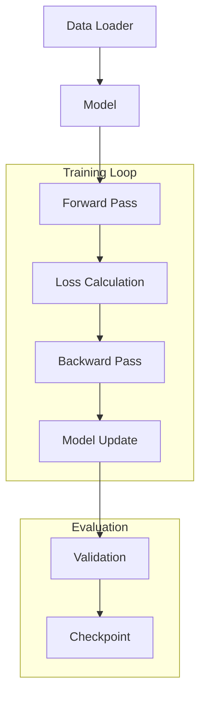
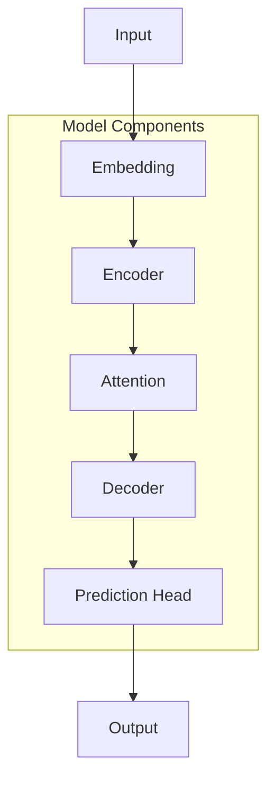

# MM-TSFlib Library Structure

This document provides a detailed overview of the MM-TSFlib library structure, explaining the flow from data processing through model training to evaluation.

## Directory Structure

```
MM-TSFlib/
├── data/                      # Dataset storage
├── data_provider/            # Data loading and preprocessing
├── models/                   # Model implementations
├── layers/                   # Reusable neural network layers
├── exp/                      # Experiment implementations
├── utils/                    # Utility functions
├── scripts/                  # Training and evaluation scripts
└── run.py                    # Main entry point
```

## Data Flow

### 1. Data Provider (`data_provider/`)
- **data_factory.py**: Factory pattern for creating data loaders
- **data_loader.py**: Core data loading and preprocessing
- **m4.py**: M4 competition dataset handling
- **uea.py**: UEA dataset handling

### 2. Data Processing Pipeline


## Model Architecture

### 1. Base Components (`layers/`)
- **Transformer_EncDec.py**: Encoder-decoder architecture
- **SelfAttention_Family.py**: Various attention mechanisms
- **Embed.py**: Data embedding layers
- **AutoCorrelation.py**: Autocorrelation mechanisms
- **FourierCorrelation.py**: Fourier-based attention
- **MultiWaveletCorrelation.py**: Wavelet-based attention

### 2. Model Implementations (`models/`)


## Training Pipeline

### 1. Experiment Setup (`exp/`)
- **exp_basic.py**: Base experiment class
- **exp_long_term_forecasting.py**: Long-term forecasting experiments
- **exp_short_term_forecasting.py**: Short-term forecasting experiments
- **exp_imputation.py**: Missing value imputation
- **exp_classification.py**: Time series classification
- **exp_anomaly_detection.py**: Anomaly detection

### 2. Training Flow


## Evaluation Pipeline

### 1. Metrics and Losses (`utils/`)
- **metrics.py**: Evaluation metrics (MSE, MAE, etc.)
- **losses.py**: Loss functions
- **dtw_metric.py**: Dynamic Time Warping
- **m4_summary.py**: M4 competition metrics

### 2. Evaluation Flow


## Key Components

### 1. Data Processing
- **Standardization**: `layers/StandardNorm.py`
- **Time Features**: `utils/timefeatures.py`
- **Data Augmentation**: `utils/augmentation.py`

### 2. Model Components
- **Attention Mechanisms**: `layers/SelfAttention_Family.py`
- **Embedding Layers**: `layers/Embed.py`
- **Transformer Blocks**: `layers/Transformer_EncDec.py`

### 3. Training Components
- **Optimizers**: Configured in experiment files
- **Loss Functions**: `utils/losses.py`
- **Early Stopping**: `utils/tools.py`

### 4. Evaluation Components
- **Metrics**: `utils/metrics.py`
- **DTW**: `utils/dtw.py`
- **M4 Evaluation**: `utils/m4_summary.py`

## File Purposes

### Core Files
- **run.py**: Main entry point for training and evaluation
- **fusion-readme.md**: Documentation for multimodal fusion
- **environment.txt**: Required dependencies

### Data Provider Files
- **data_factory.py**: Creates appropriate data loader based on dataset
- **data_loader.py**: Handles data loading, preprocessing, and batching
- **m4.py**: M4 competition specific data handling
- **uea.py**: UEA dataset specific handling

### Model Files
Each model file implements a specific architecture:
- **iTransformer.py**: Inverted Transformer architecture
- **PatchTST.py**: Patch Time Series Transformer
- **TimesNet.py**: Time Series Network
- **Autoformer.py**: Autoformer architecture
- **FEDformer.py**: Frequency Enhanced Decomposition Transformer
- **FiLM.py**: Frequency-wise Independent Learning Module
- **Koopa.py**: Koopman-based prediction
- **LightTS.py**: Lightweight Time Series model
- **MICN.py**: Multi-scale Information Cross Network
- **Nonstationary_Transformer.py**: Non-stationary Transformer
- **Pyraformer.py**: Pyramidal attention model
- **Reformer.py**: Reformer architecture
- **SegRNN.py**: Segment Recurrent Neural Network
- **TiDE.py**: Time Series Imputation and DEnoising
- **TSMixer.py**: Time Series Mixer
- **Transformer.py**: Standard Transformer

### Layer Files
- **Transformer_EncDec.py**: Encoder-decoder architecture
- **SelfAttention_Family.py**: Various attention mechanisms
- **Embed.py**: Data embedding layers
- **AutoCorrelation.py**: Autocorrelation mechanisms
- **FourierCorrelation.py**: Fourier-based attention
- **MultiWaveletCorrelation.py**: Wavelet-based attention
- **StandardNorm.py**: Standardization layers
- **Conv_Blocks.py**: Convolutional blocks

### Experiment Files
- **exp_basic.py**: Base experiment class
- **exp_long_term_forecasting.py**: Long-term forecasting
- **exp_short_term_forecasting.py**: Short-term forecasting
- **exp_imputation.py**: Missing value imputation
- **exp_classification.py**: Time series classification
- **exp_anomaly_detection.py**: Anomaly detection

### Utility Files
- **tools.py**: General utility functions
- **timefeatures.py**: Time feature extraction
- **metrics.py**: Evaluation metrics
- **losses.py**: Loss functions
- **dtw_metric.py**: Dynamic Time Warping
- **m4_summary.py**: M4 competition metrics
- **augmentation.py**: Data augmentation techniques
- **ADFtest.py**: Augmented Dickey-Fuller test
- **masking.py**: Data masking utilities
- **print_args.py**: Argument printing utilities

## Data Flow Diagram



## Training Flow Diagram



## Model Architecture Diagram

